# Hi there, I'm XIN 👋

<table width="100%">
<tr>
<td valign="top"  width="46%">
  
- 🌱 I’m currently learning Full Stack developer
- 👯 I’m looking to collaborate on [memo-sutdio](https://github.com/taosin/memo-studio)
- 🤔 I’m looking for help with [Specific Challenges]
- 💬 Ask me about [Topics or Expertise]
- 📫 How to reach me: taoxin167@gmail.com
- 😄 Pronouns: XIN

**「Stay hungry，Stay foolish.」** ❤️
</td>
<td valign="center"  width="54%">
  
  <!--  -->
</td>
</tr>
</table>

<table width="100%">
<tr>
<td valign="top"  width="70%">

  
</td>
<td width="30%">

</td>
</tr>
</table>

<table>
  <tr>
    <td colspan="2">
      <!--  -->
    </td>
  </tr>
  <tr>
    <td colspan="2">Skills</td>
  </tr>
  <tr>
    <td>
      Front End
    </td>
    <td>
      
    </td>
  </tr>
  <tr>
    <td>
      Back End
    </td>
    <td>
      
    </td>
  </tr>
  <tr>
    <td>
      Tools
    </td>
    <td>
      
    </td>
  </tr>
</table>

